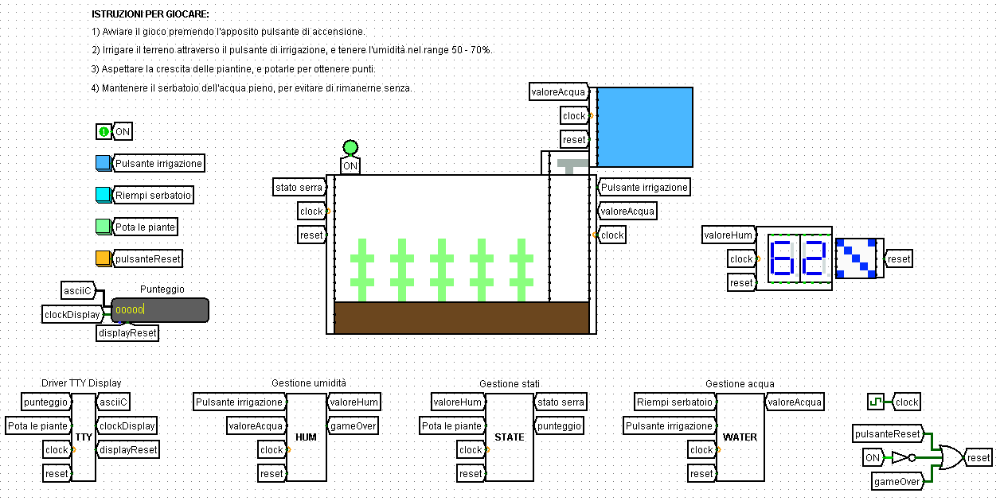

<h1 style="color:#7cb853;">Botanical garden</h1>
This logisim project consists of the implementation of a game that allows the user to manage a vegetable garden through some tools at his disposal.

The fundamental parameter is the humidity of the terrain, which is shown on the screen; since it will decrease over time, the user will have to keep it in a certain range, using an irrigation button, in such a way to allow the seedlings to be able to grow, and then to prune them. 

There are 4 states:
according to the current state of the plants, pruning will give a certain score, making them return seedlings in the initial state; 
this score will be added to the total score the user can see on screen. 

The irrigation will be followed by an animation (always on screen) that simulates the fall of the water into the ground; when the water reaches the ground, the humidity grows. 
It will only be possible to irrigate if the water tank is fairly full, and to fill it you will need to press another button. 

Over time, the humidity will decrease more and more rapidly, so as to make the game more challenging and increase the difficulty. The game over is activated when the humidity reaches 0%, so the aim will be to total the most points without losing.

## Configuration
For the correct use of the game, you must set the Clock frequency to 64Hz.
## How to play
1. Start the game by pressing the appropriate power button.
2. Irrigate the soil through the irrigation button, and keep the humidity in the range 50 - 70%,
3. Wait for the seedlings to grow, and prune them to get points.
4. Keep the water tank full, to avoid missing it.

## Sample image
